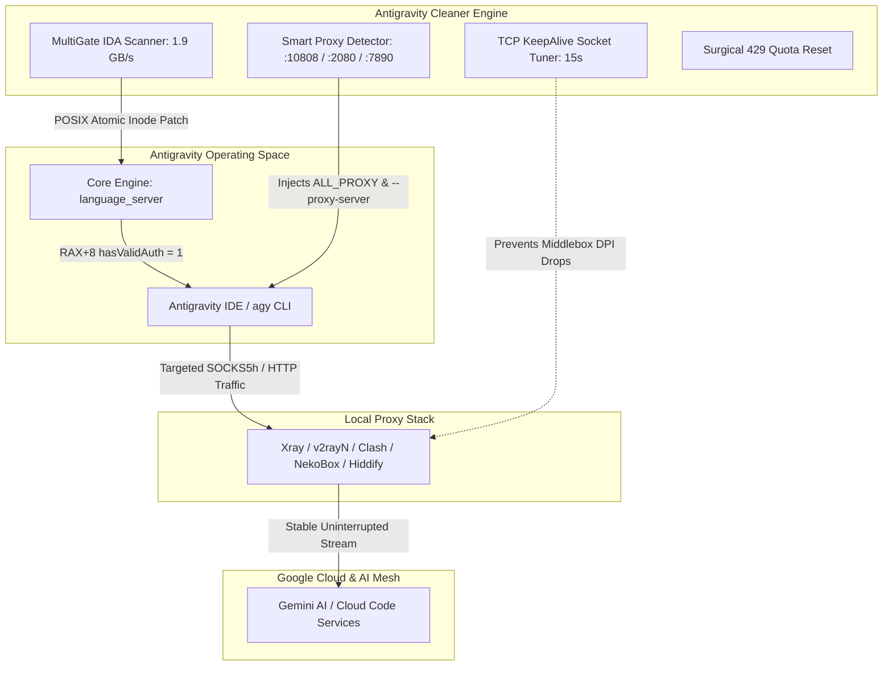

<p align="center">
  <a href="README.md">🇺🇸 English</a> •
  <a href="README.fa.md">🇮🇷 فارسی</a> •
  <a href="README.ar.md">🇸🇦 العربية</a> •
  <a href="README.ru.md">🇷🇺 Русский</a> •
  <a href="README.es.md">🇪🇸 Español</a> •
  <a href="README.tr.md">🇹🇷 Türkçe</a> •
  <a href="README.zh.md">🇨🇳 简体中文</a> •
  <a href="README.ur.md">🇵🇰 اردو</a>
</p>

# ⚡ Antigravity Cleaner — Ultimate AI Freedom Toolkit (v5.2.0)

<div align="center">
  
  <br>
  
  [](https://github.com/tawroot/antigravity-cleaner/releases)
  [](https://golang.org)
  [](docs/test-reports/benchmarks.log)
  [](docs/test-reports/benchmarks.log)
  [](https://github.com/tawroot/antigravity-cleaner)
  []()
</div>

> *Dedicated from the heart to all people, developers, and creators who are caught between domestic filtering from within and digital sanctions from without — in 🇮🇷 Iran, 🇨🇳 China, 🇷🇺 Russia, 🇹🇷 Turkey, 🇨🇺 Cuba, 🇸🇾 Syria, 🇰🇵 North Korea, 🇧🇾 Belarus, 🇸🇩 Sudan, 🇻🇪 Venezuela, 🇦🇫 Afghanistan, 🇲🇲 Myanmar, and every restricted corner of our world. Access to knowledge, technology, and artificial intelligence is a fundamental human right, not a privilege.*  
> — **@dalroot**

---

## ⚡ What is Antigravity Cleaner?

**Antigravity Cleaner** is an enterprise-grade, high-performance systems utility engineered in **pure Go** with both an authentic **1-Click Retro KeyGen GUI** and a 2026-standard terminal dashboard (**Lipgloss & Bubbletea**). It completely solves region blocking, account eligibility barriers, 429 quota exhaustion, and streaming connection drops for:
- **Google Antigravity 2.x**
- **Antigravity IDE**
- **Antigravity CLI (`agy`)**
- **Official VS Code Extension (`google.google-antigravity`)**

Unlike conventional scripts that force users to route their entire operating system through a heavy, root-permission **TUN Mode (VPN)**, Antigravity Cleaner introduces an automated **No-TUN Smart Proxy Injector** that routes Antigravity traffic directly to local proxies (Xray, Clash, NekoBox, Hiddify) with zero system overhead.

> 🔒 **100% Offline & Zero-Track Guarantee:**
> Antigravity Cleaner operates **100% locally on `127.0.0.1`**. It contains **ZERO telemetry, ZERO analytics, and ZERO remote network requests**. Your source code, API keys, and chats are never uploaded or tracked. Fully open-source and auditable under GPL-3.0.

---

## 💾 1-Click Retro KeyGen GUI (Zero Terminal Required)

Prefer a simple graphical interface? Download the standalone executable for your operating system from [Releases](https://github.com/tawroot/antigravity-cleaner/releases) and simply **double-click** to run. No terminal commands, no Python runtime, and zero external dependencies!

<div align="center">
  
  <br>
  <sub><em>Authentic Windows 95/98 style Patcher with live demoscene starfield, Web Audio 8-bit sound effects & 1-click Auto-Fix.</em></sub>
</div>

<br>

| Operating System | Standalone Binary | Mode |
| :--- | :---: | :--- |
| 🪟 **Windows** (64-bit) | [](https://github.com/tawroot/antigravity-cleaner/releases/latest/download/antigravity-cleaner-windows-amd64.exe)<br><sub>[View on Releases](https://github.com/tawroot/antigravity-cleaner/releases/latest)</sub> | Double-click `.exe` (opens GUI automatically) |
| 🍎 **macOS** (Apple Silicon M1–M4) | [](https://github.com/tawroot/antigravity-cleaner/releases/latest/download/antigravity-cleaner-darwin-arm64)<br><sub>[View on Releases](https://github.com/tawroot/antigravity-cleaner/releases/latest)</sub> | Double-click or `./antigravity-cleaner-darwin-arm64` |
| 🍎 **macOS** (Intel) | [](https://github.com/tawroot/antigravity-cleaner/releases/latest/download/antigravity-cleaner-darwin-amd64)<br><sub>[View on Releases](https://github.com/tawroot/antigravity-cleaner/releases/latest)</sub> | Double-click or `./antigravity-cleaner-darwin-amd64` |
| 🐧 **Linux** (x86_64) | [](https://github.com/tawroot/antigravity-cleaner/releases/latest/download/antigravity-cleaner-linux-amd64)<br><sub>[View on Releases](https://github.com/tawroot/antigravity-cleaner/releases/latest)</sub> | Double-click or `ag-cleaner gui` |
| 🐧 **Linux** (ARM64) | [](https://github.com/tawroot/antigravity-cleaner/releases/latest/download/antigravity-cleaner-linux-arm64)<br><sub>[View on Releases](https://github.com/tawroot/antigravity-cleaner/releases/latest)</sub> | Double-click or `ag-cleaner gui` |

<br>

### 📑 Quick Navigation
- [💾 1-Click Graphical Patcher](#-1-click-retro-keygen-gui-zero-terminal-required)
- [🚀 Quick CLI Install (One-Liner)](#-quick-install-one-liner)
- [💻 2026 Visual Dashboard (TUI)](#-2026-visual-dashboard-tui)
- [🛠️ CLI Subcommands & Diagnostics](#️-cli-subcommands)
- [🏛️ System Architecture](#️-system-architecture)
- [🛡️ Security, Privacy & Integrity Guarantee](#️-security-privacy--integrity-guarantee)
- [📊 Benchmarks & Verified Test Reports](#-benchmarks--verified-test-reports)
- [🥊 Comparison Matrix](#-comparison-matrix)
- [🔧 Troubleshooting Matrix](#-troubleshooting-matrix)
- [👥 Credits & Attribution](#-credits--attribution)

---

## 🏛️ System Architecture



---

## 🛡️ Security, Privacy & Integrity Guarantee

- 🔒 **100% Local Execution**: Zero external telemetry, no remote analytics, and no third-party network calls. The tool operates entirely on your machine.
- 💬 **Conversation Preservation**: The surgical quota reset (`ag-cleaner clean`) targets only corrupt session cookies and DIPS caches. Your prompts, global storage, and project chat histories are **strictly protected and preserved**.
- ⚛️ **POSIX Atomic Safety**: Core binaries are patched using atomic inode replacement (`os.Rename`), ensuring running processes never crash, corrupt, or lock with `ETXTBSY`.

---

## 📊 Benchmarks & Verified Test Reports

| Metric | Measured Value | Verification Log |
| :--- | :--- | :--- |
| **In-Memory Pattern Scanning** | **1,901.84 MB/s (~1.9 GB/s)** | [`benchmarks.log`](docs/test-reports/benchmarks.log) |
| **171MB Binary Patch Duration** | **0.23 seconds** | [`benchmarks.log`](docs/test-reports/benchmarks.log) |
| **Doctor Concurrent Audit** | **~2.5 seconds** | [`live_system_test.log`](docs/test-reports/live_system_test.log) |
| **Surgical 429 Cache Flush** | **16 artifacts purged (0 chat loss)** | [`live_system_test.log`](docs/test-reports/live_system_test.log) |
| **Unit Test Pass Rate** | **100% (All packages passing)** | [`benchmarks.log`](docs/test-reports/benchmarks.log) |

---

## 🥊 Comparison Matrix

| Feature | Single-Purpose Patchers (`open-antigravity-patcher`, `QNIX`, `yhan-sun`) | Process/DLL Injectors (`antigravity-proxy`) | **⚡ Antigravity Cleaner (v5.2)** |
| :--- | :---: | :---: | :---: |
| **Language & Architecture** | Python 3 (requires runtime, `pip`, external packages) | Windows-only C++ / DLL injection | **Native Pure Go (Zero dependencies, Single Executable)** |
| **User Interface (TUI)** | Basic text stdout | Basic console | **2026 Lipgloss Rounded Dashboard** |
| **No-TUN Proxy Launcher** | ❌ (Forces root TUN mode) | ❌ None | ✅ **Auto-detects Xray/Clash/NekoBox & Injects** |
| **Stream KeepAlive Tuner** | ❌ (Frequent stream drops) | ❌ None | ✅ **Aggressive socket keepalive against DPI drops** |
| **Surgical 429 Quota Reset** | ❌ (Wipes entire config & chats) | ❌ (Deletes everything) | ✅ **Cleans token cache, PRESERVES all chats!** |
| **Core Binary Patch** | x86_64 / ARM64 | ❌ None | ✅ **MultiGate IDA-style machine-code patch** |
| **IDE Frontend Patch (`main.js`)** | ✅ Regex patch | ❌ None | ✅ **Automated patch + VS Code cache purge** |
| **VS Code Re-download Guard** | ✅ Basic | ❌ None | ✅ **Full Guard + Channel Lock** |
| **Diagnostic Doctor Tool** | ❌ None | ⚠️ Limited | ✅ **Concurrent 2s latency & DNS leak probe** |
| **POSIX Atomic Replacement** | Python tempfile | ❌ None | ✅ **Atomic Inode swap (no `ETXTBSY` on running app)** |

---

## 🚀 Quick Install (One-Liner)

### 🐧 Linux & 🍎 macOS (Apple Silicon M1/M2/M3/M4 & Intel)
Run in your terminal:
```bash
curl -fsSL https://raw.githubusercontent.com/tawroot/antigravity-cleaner/main/install.sh | bash
```

### 🪟 Windows (PowerShell)
Open PowerShell (as Administrator) and run:
```powershell
irm https://raw.githubusercontent.com/tawroot/antigravity-cleaner/main/install.ps1 | iex
```

---

## 💻 2026 Visual Dashboard (TUI)
 
Run `ag-cleaner` in your terminal for an interactive, beautifully styled terminal menu:

<div align="center">
  
</div>

### 🎬 Live Demo Walkthrough
See Antigravity Cleaner v5.1 in action — automated detection, zero-TUN proxy injection, and one-click unlocking:

https://github.com/user-attachments/assets/demo.webm

> *Video demo: [`docs/images/demo.webm`](docs/images/demo.webm)*

Run `ag-cleaner doctor` for a non-intimidating, high-aesthetic health card:

```text
╭────────────────────────────────────────────────────────────────────────────╮
│  🩺 Antigravity Cleaner — Health & Connectivity Audit                      │
│ ────────────────────────────────────────────────────────────────────────   │
│                                                                            │
│  Antigravity IDE         READY   Installed & Detected                      │
│  Core Engine             READY   Unlocked (Patched)                        │
│  Proxy Connection        READY   Active on 127.0.0.1:10808 (v2ray / Xray)  │
│  Google DNS              READY   Healthy (16 IPs resolved)                 │
│  Cloud Code Service      READY   Connected (1100ms, Fast)                  │
│  Google Accounts         READY   Connected (1800ms, Fast)                  │
│  Gemini AI API           READY   Connected (950ms, Fast)                   │
│                                                                            │
╰────────────────────────────────────────────────────────────────────────────╯
                                                                              
   ONLINE  System is optimized. You can launch Antigravity with Smart Proxy!
```

---

## 🛠️ CLI Subcommands

```bash
# Launch interactive menu
ag-cleaner

# Launch Retro KeyGen GUI (Classic Win95 Desktop Window)
ag-cleaner gui

# Health & latency diagnostics (clean card)
ag-cleaner doctor

# Detailed diagnostics with debug traces
ag-cleaner doctor --verbose

# Apply all patches (Core binary, CLI, IDE frontend)
ag-cleaner patch all

# Launch Antigravity with smart proxy injection (No TUN mode needed!)
ag-cleaner launch

# Reset HTTP 429 Quota without losing conversation history
ag-cleaner clean

# Terminate all running Antigravity & language_server zombie processes
ag-cleaner kill

# Generate desktop shortcut with pre-configured proxy
ag-cleaner create-launcher

# View project attribution & credits
ag-cleaner about
```

---

## 🤖 AI Agent Skill (`skills/antigravity-cleaner`)

Antigravity Cleaner provides a native **Agent Skill** (`skills/antigravity-cleaner/SKILL.md`) that enables AI coding assistants (Google Antigravity, Claude Code, Cursor, Codex) to self-heal their environment when encountering API restrictions, quota limits, or network timeouts:

- **Automated Self-Audit**: Agents trigger `ag-cleaner doctor` on connection loss.
- **Autonomous Quota Healing**: Agents run surgical clean on HTTP 429 without human intervention.
- **Zero Configuration**: Vendored directly inside the project root for automatic discovery.

---

## 🔧 Troubleshooting Matrix (Supported Error Codes & Issues)

Antigravity Cleaner provides exact fixes for the most common real-world errors encountered by developers worldwide:

| Error Code / Message | Primary Trigger | Instant Automated Fix |
| :--- | :--- | :--- |
| **`Your current account is not eligible for Antigravity, because it is not currently available in your location`** | Client-side eligibility checks in `main.js`, `agy` binary, and VS Code extension | Run `ag-cleaner patch all` (or click **[Auto-Fix]** in Retro GUI) |
| **`Antigravity Gemini: opaque "User location is not supported" (HTTP 400)`** | Upstream API regional gating + direct connection through unsupported ISP | Launch with `ag-cleaner launch` (Direct proxy injection without TUN mode) |
| **`Unknown: There was a network issue connecting to the server, please try again.`** | Middlebox / DPI firewall terminating idle TLS/SSE streams during agent thinking | Launch with `ag-cleaner launch` (Enforces 15s TCP KeepAlive socket tuning) |
| **`HTTP 429 Quota Exceeded` / `Too Many Requests`** | Corrupted session tokens, rate-limit buckets, and bloated cache | Run `ag-cleaner clean` (Surgically purges rate-limit tokens, **100% chats preserved!**) |
| **`isGoogleInternal` / Local Eligibility Gate check failed** | Embedded machine-code check in `language_server` / core engine | Run `ag-cleaner patch all` (IDA-style MultiGate binary patch) |
| **`Antigravity won't launch` / Stale `SingletonLock` error** | Unclean exit or display server crash leaving dead PID lockfile | Run `ag-cleaner launch` or `ag-cleaner clean` (Auto-removes dead lockfiles) |
| **`Failed to fetch` / `language_server crashed / connection refused`** | Zombie background processes or orphaned Electron sockets | Run `ag-cleaner kill` to terminate zombies, then launch cleanly |
| **Sluggish Workspace & Token Generation Lag** | Accumulated GPU/Dawn cache and dead WebSocket buffers | Run `ag-cleaner clean` to flush GPU and network cache |

---

## 🏗️ Building from Source

Requires **Go 1.22+**:

```bash
git clone https://github.com/tawroot/antigravity-cleaner.git
cd antigravity-cleaner

# Build for current machine
make build

# Cross-compile for Linux, macOS (Intel & ARM64), and Windows
make release
```

---

## 👥 Credits & Attribution

- **Lead Architect & Maintainer:** **[@dalroot](https://github.com/dalroot)**
- **Co-Pilot & Pair Programming:** **Antigravity AI (Google DeepMind)** — *Crafted in creative pair-programming using Google's own AI agent to liberate Google's developer tools for restricted coders worldwide!* 🤖
- **License:** GNU General Public License v3.0 (GPL-3.0)
- Dedicated to uncensored technology, open-source accessibility, and developer freedom everywhere.

---

## 📈 Star History

If this tool unblocked your workflow, a ⭐ star helps other developers discover it.

<a href="https://star-history.com/#tawroot/antigravity-cleaner&Date">
 <picture>
   <source media="(prefers-color-scheme: dark)" srcset="https://api.star-history.com/svg?repos=tawroot/antigravity-cleaner&type=Date&theme=dark" />
   <source media="(prefers-color-scheme: light)" srcset="https://api.star-history.com/svg?repos=tawroot/antigravity-cleaner&type=Date" />
   
 </picture>
</a>

---

## 💬 Community & Discussions

Questions, feature requests, or want to share your setup?
[**Open a Discussion →**](https://github.com/tawroot/antigravity-cleaner/discussions)
