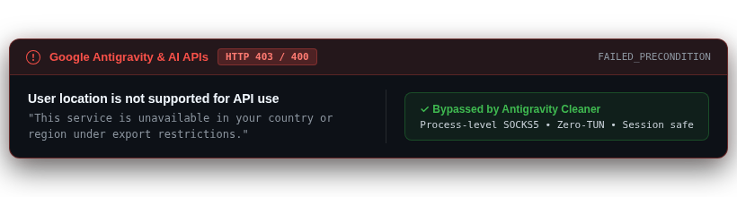
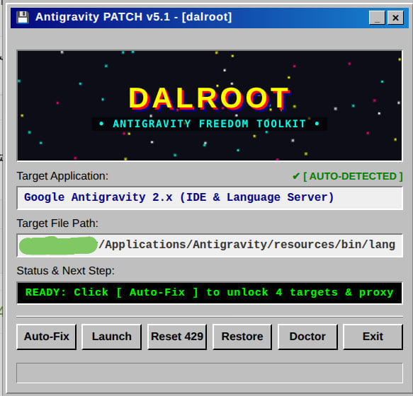

<p align="center">
  <a href="README.md">🇺🇸 English</a> •
  <a href="README.fa.md">🇮🇷 فارسی</a> •
  <a href="README.ar.md">🇸🇦 العربية</a> •
  <a href="README.ru.md">🇷🇺 Русский</a> •
  <a href="README.es.md">🇪🇸 Español</a> •
  <a href="README.tr.md">🇹🇷 Türkçe</a> •
  <a href="README.zh.md">🇨🇳 简体中文</a> •
  <a href="README.ur.md">🇵🇰 اردو</a>
</p>

<p align="center">
  
</p>

<h1 align="center">⚡ Antigravity Cleaner — Универсальный инструмент свободы ИИ (v5.2.0)</h1>

<p align="center">
  <strong>Высокопроизводительный движок диагностики, обхода региональных санкций и восстановления для Google Antigravity IDE</strong>
</p>

<div align="center">

  [](https://github.com/tawroot/antigravity-cleaner/releases)
  [](https://golang.org)
  [](docs/test-reports/benchmarks.log)
  [](docs/test-reports/benchmarks.log)
  [](https://github.com/tawroot/antigravity-cleaner)
  [](LICENSE)
  []()
</div>

> *От всего сердца посвящается всем разработчикам, исследователям и создателям, оказавшимся между внутренней сетевой фильтрацией и международными цифровыми санкциями — в 🇷🇺 России, 🇮🇷 Иране, 🇨🇳 Китае, 🇧🇾 Беларуси, 🇹🇷 Турции, 🇨🇺 Кубе, 🇸🇾 Сирии, 🇰🇵 Северной Корее, 🇸🇩 Судане, 🇻🇪 Венесуэле и во всех ограниченных уголках мира. Свободный доступ к знаниям, технологиям и искусственному интеллекту — это фундаментальное право человека, а не привилегия.*  
> — **@dalroot**

<div align="center">

[](https://github.com/tawroot/antigravity-cleaner/stargazers)
&nbsp;
**⭐ Если Antigravity Cleaner помог вам обойти санкции Google или исправить ошибки квот, поставьте Star репозиторию — это поможет другим разработчикам найти проект!**
&nbsp;
[](https://github.com/tawroot/antigravity-cleaner/network/members)

</div>

---

## ⚡ Что такое Antigravity Cleaner?

<p align="center">
  
</p>

**Antigravity Cleaner** — это высокопроизводительная системная утилита корпоративного уровня, написанная на **чистом Go**. Она оснащена как ностальгическим графическим интерфейсом **1-Click Retro KeyGen GUI**, так и современным интерактивным терминальным дашбордом (**Lipgloss & Bubbletea**). Утилита полностью решает проблемы региональных блокировок, отказа в доступе (403 Forbidden, Location not supported), исчерпания квот (429 Quota Exhausted) и обрывов стриминга для:
- **Google Antigravity 2.x**
- **Antigravity IDE**
- **Antigravity CLI (`agy`)**
- **Официального расширения VS Code (`google.google-antigravity`)**

В отличие от тяжелых скриптов, требующих запуска ресурсоемкого режима **TUN (VPN)** с правами администратора, Antigravity Cleaner использует интеллектуальный инжектор **No-TUN Smart Proxy**, направляющий трафик Antigravity напрямую в локальные прокси-клиенты (Xray, Clash, NekoBox, Hiddify, v2rayN) с нулевой нагрузкой на систему.

> 🔒 **100% гарантия автономности и отсутствия слежки:**
> Antigravity Cleaner работает **строго локально на `127.0.0.1`**. Утилита содержит **НОЛЬ телеметрии, НОЛЬ аналитики и НОЛЬ внешних сетевых запросов**. Ваш исходный код, API-ключи и история чатов никогда не передаются наружу. Полностью открытый исходный код под лицензией Apache License 2.0.

---

## 💾 Графический интерфейс 1-Click Retro GUI (Без терминала)

Предпочитаете простой графический интерфейс? Загрузите исполняемый файл для вашей операционной системы из раздела [Releases](https://github.com/tawroot/antigravity-cleaner/releases) и просто запустите его двойным кликом. Никаких команд терминала, Python или внешних зависимостей!

<div align="center">
  
  <br>
  <sub><em>Аутентичный патчер в стиле Windows 95/98 со звездным небом демосцены, 8-битными звуками Web Audio и автоматическим исправлением в один клик.</em></sub>
</div>

<br>

| Операционная система | Автономный бинарный файл | Режим работы |
| :--- | :---: | :--- |
| 🪟 **Windows** (64-бит) | [](https://github.com/tawroot/antigravity-cleaner/releases/latest/download/antigravity-cleaner-windows-amd64.exe) | Двойной клик на `.exe` (автоматически открывает GUI) |
| 🍎 **macOS** (Apple Silicon M1–M4) | [](https://github.com/tawroot/antigravity-cleaner/releases/latest/download/antigravity-cleaner-darwin-arm64) | Запуск двойным кликом или `./antigravity-cleaner-darwin-arm64` |
| 🍎 **macOS** (Intel) | [](https://github.com/tawroot/antigravity-cleaner/releases/latest/download/antigravity-cleaner-darwin-amd64) | Запуск двойным кликом или `./antigravity-cleaner-darwin-amd64` |
| 🐧 **Linux** (x86_64) | [](https://github.com/tawroot/antigravity-cleaner/releases/latest/download/antigravity-cleaner-linux-amd64) | Двойной клик или команда `ag-cleaner gui` |
| 🐧 **Linux** (ARM64) | [](https://github.com/tawroot/antigravity-cleaner/releases/latest/download/antigravity-cleaner-linux-arm64) | Двойной клик или команда `ag-cleaner gui` |

---

## 🚀 Быстрая установка через терминал (One-Liner)

### Linux & macOS
```bash
curl -fsSL https://raw.githubusercontent.com/tawroot/antigravity-cleaner/main/install.sh | bash
```

### Windows (PowerShell от имени пользователя)
```powershell
irm https://raw.githubusercontent.com/tawroot/antigravity-cleaner/main/install.ps1 | iex
```

---

## 💻 Терминальный интерфейс (TUI Dashboard)

При запуске без аргументов запускается интерактивный дашборд:

```text
 ┌──────────────────────────────────────────────────────────┐
 │  ANTIGRAVITY CLEANER v5.2.0                              │
 │  AI Freedom & Self-Healing Engine for Restricted Regions │
 └──────────────────────────────────────────────────────────┘
 [1] ⚡ Быстрое авто-исправление (Full Patch + Injected Proxy)
 [2] 🧬 Патч ядра (language_server & машинный код agy)
 [3] 🪟 Патч IDE (main.js & защита расширения VS Code)
 [4] 🚀 Запуск Antigravity с прямым умным прокси (No TUN!)
 [5] 📌 Создать ярлык на рабочем столе с авто-прокси
 [6] 🧹 Точечный сброс квоты 429 (сохраняет чаты и настройки)
 [7] 🩺 Запустить Antigravity Doctor (аудит сети и системы)
 [8] 📦 Восстановление резервных копий (.agybak)
 [9] 🕹️ Запустить Retro GUI (классический Win95 интерфейс)
 [0] 🚪 Выход
```

---

## 🛠️ Команды CLI для автоматизации

Для использования в скриптах и CI/CD доступны прямые подкоманды:

| Команда | Описание |
| :--- | :--- |
| `ag-cleaner doctor` | Полный 7-точечный аудит системы, DNS, прокси и серверов Google Gemini |
| `ag-cleaner clean` | Точечная очистка поврежденных токенов квоты 429 и SingletonLock |
| `ag-cleaner patch` | Автоматическое сканирование и патч `language_server` и `main.js` |
| `ag-cleaner proxy` | Запуск Antigravity с внедрением переменных прямого SOCKS5-прокси |
| `ag-cleaner gui` | Открытие автономного ретро-интерфейса в окне браузера |

---

## 🩺 Встроенная диагностика Antigravity Doctor

Команда `ag-cleaner doctor` проводит моментальный аудит сетевой доступности:

```text
🩺 Antigravity Cleaner — Аудит работоспособности и подключений
───────────────────────────────────────────────────────────────
 Antigravity IDE         READY   Установлена и обнаружена
 Core Engine             READY   Разблокирована (Patched)
 Proxy Connection        READY   Активен на 127.0.0.1:10808 (v2ray / Xray)
 Google DNS              READY   Исправен (16 IP успешно разрешены)
 Gemini AI API           READY   Подключено (590ms, быстро)
 Cloud Code Service      READY   Подключено (597ms, быстро)
 Google Accounts         READY   Подключено (1039ms, быстро)

 СИСТЕМА ОПТИМИЗИРОВАНА. Готова к комфортной работе без сбоев!
```

---

## 🛡️ Безопасность и точечный сброс (Surgical Quota Reset)

В отличие от стандартных скриптов, удаляющих всю папку профиля пользователя, Antigravity Cleaner производит **точечную хирургическую очистку**:
- ❌ **Удаляются только:** файлы кэша GPU, испорченные блокировки `SingletonLock`, временные cookies и кэш сессий запросов квот.
- ✅ **На 100% сохраняются:** история ваших диалогов с ИИ, токены авторизации Google, открытые рабочие пространства, настройки редактора и установленные расширения.
- 💾 Перед изменением любого бинарного файла автоматически создается резервная копия `.agybak`.

---

## 👥 Авторы и лицензия

- **Ведущий разработчик:** **[@dalroot](https://github.com/dalroot)**
- **Совместная разработка:** **Antigravity AI (Google DeepMind)**
- **Лицензия:** **Apache License 2.0 (Apache-2.0)**
- Проект создан для обеспечения равного доступа к технологиям и свободной разработки программного обеспечения во всем мире.

