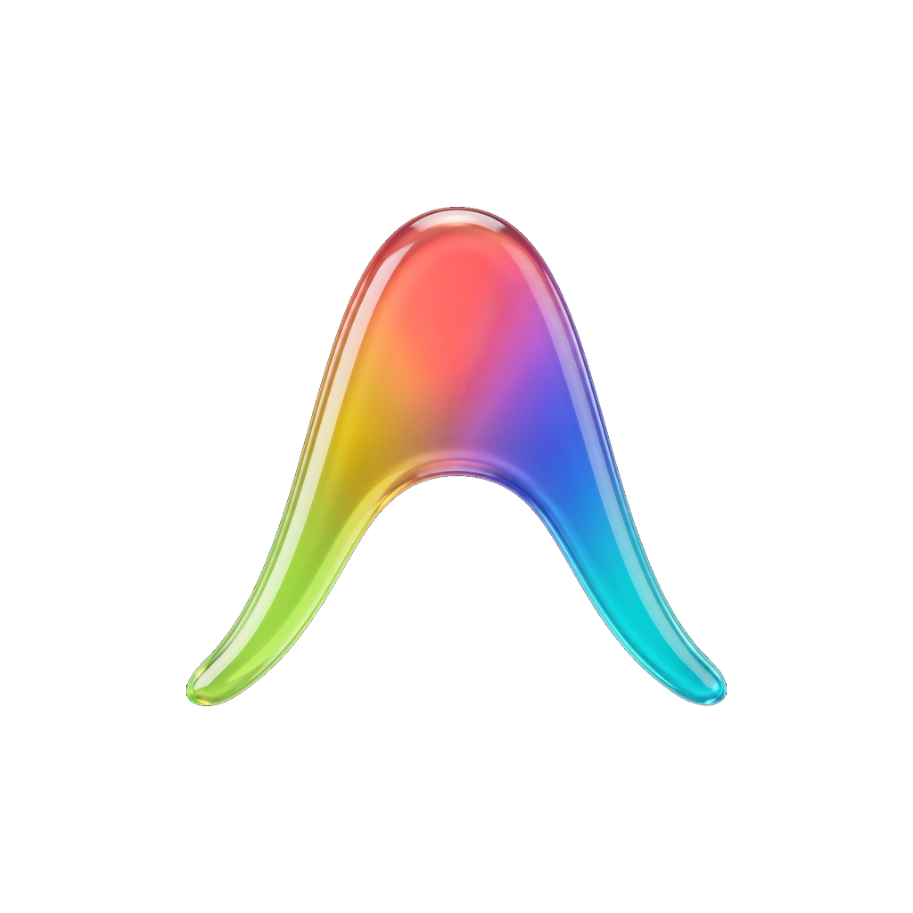

<p align="center">
  
</p>

<h1 align="center">Antigravity Cleaner Shell (v4.1.0)</h1>

<div align="center">

  [](https://github.com/tawroot/antigravity-cleaner/releases)
  [](docs/LICENSE.md)
  [](https://github.com/tawroot/antigravity-cleaner)
  []()
  [](docs/SECURITY.md)
</div>

> **İran halkına ve dijital yaptırımlar ile internet kısıtlamaları altında sıkışıp kalan herkese ithaf edilmiştir.**
> Bilgiye, teknolojiye ve geliştirme araçlarına özgür erişimin her insanın en temel hakkı olduğuna inanıyoruz. Bu araç, dijital özgürlüğün sesidir; hem içeriden hem de dışarıdan etrafımıza örülen duvarları aşmak için tasarlandı.

---

## İçindekiler
1. [Bu Araç Kimin İçin?](#bu-araç-kimin-için)
2. [Proje Hakkında](#proje-hakkında)
3. [Kolay Kurulum (Tek Satır)](#kolay-kurulum-tek-satır)
4. [Temel Özellikler](#temel-özellikler)
5. [Güvenlik ve Gizlilik](#güvenlik-ve-gizlilik)
6. [Modül Kılavuzu](#modül-kılavuzu)
7. [Yol Haritası (Roadmap)](#yol-haritası-roadmap)
8. [Lisans](#lisans)
9. [Yazar Hakkında](#yazar-hakkında)

---

## 🎯 Bu Araç Kimin İçin?

Bu araç özellikle şunlar için tasarlanmıştır:

### 🌍 **Yaptırım Altındaki Bölgelerdeki Geliştiriciler**
Eğer **İran, Çin, Rusya, Küba, Suriye, Kuzey Kore, Türkmenistan veya Türkiye'de** iseniz, muhtemelen şu hatalarla karşılaşmışsınızdır:
*   Google servislerine erişirken `HTTP Error 403: Forbidden`
*   Antigravity IDE kurulumunda `ModuleNotFoundError`
*   Gemini AI, Colab veya Cloud Platform'a erişimi engelleyen Region Lock hataları
*   Geliştirici araçlarını engelleyen Büyük Güvenlik Duvarı (Great Firewall) veya hükümet sansürü

### 💻 **Kurulum Hatalarıyla Karşılaşan Programcılar**
Bu aracın çözdüğü yaygın hatalar:
*   `ERROR: Antigravity installation failed`
*   `Pip install error: Could not find a version that satisfies the requirement`
*   `Dependency conflict detected`
*   Sistem yeniden kurulumundan sonra bozulan tarayıcı oturumları

### 🔧 **Google Servislerine İhtiyaç Duyan Herkes**
*   Gemini AI, Google Colab veya Cloud Platform'a ihtiyaç duyan geliştiriciler
*   DNS/ağ müdahalesi yaşayan kullanıcılar
*   Sistem değişikliklerinde tarayıcı oturumlarını korumak isteyenler

**Eğer "antigravity install error nasıl düzeltilir" veya "region lock nasıl aşılır" diye Google'da arama yaptıysanız — bu araç tam size göre.**

---

## Proje Hakkında
**Antigravity Cleaner Shell**, geliştiricilere, freelancerlara ve ileri düzey kullanıcılara yardımcı olmak amacıyla tasarlanmış, **PowerShell** tabanlı, açık kaynaklı (Open Source) ve güçlü bir araçtır. Bu aracın temel amacı, tarayıcı oturumlarını akıllıca yönetmek, Google yaptırımlarını (Google Sanctions) aşmak ve yazılım geliştirme süreçleri için sistemi optimize etmektir.

Bu sürüm (**v4.1.0**), tamamen Windows, macOS ve Linux üzerinde yerel (Multi-Platform) olarak çalışacak şekilde yeniden yazılmıştır.

---

## Kolay Kurulum (Tek Satır)

Kurulum ve çalıştırma için PowerShell'i açın ve sadece aşağıdaki satırı kopyalayıp Enter tuşuna basın.
(Bu komut programı otomatik olarak indirir ve masaüstünüzde bir kısayol oluşturur)

```powershell
iwr https://raw.githubusercontent.com/tawroot/antigravity-cleaner/main/install.ps1 -useb | iex
```

*Hata alırsanız, terminali Yönetici (Administrator) olarak çalıştırın.*

<div align="center">
  
  <p><i>Modüller ve Kullanıcı Arayüzü Genel Bakış</i></p>
</div>

---

## Temel Özellikler

### 1. Gelişmiş Oturum Yöneticisi (Session Manager)
Antigravity'nin kalbi olan bu modül, tarayıcı profillerinizi yönetmenizi ve taşımanızı sağlar.
*   **Akıllı Algılama:** Chrome, Edge, Brave ve Opera tarayıcı profillerini ve bağlı e-posta adreslerini otomatik olarak algılar.
*   **Çift Modlu Yedekleme (Dual Mode Backup):**
    *   **Light Mod:** Sadece çerezleri, giriş bilgilerini ve temel ayarları yedekler (~20MB). Hızlı taşıma ve şifre girmeden oturum açmak için idealdir.
    *   **Full Mod:** Tüm uzantılar, geçmiş ve önbellek dahil olmak üzere tam profil yedeği alır (~500MB+).
*   **Antigravity Desktop Desteği:** Antigravity IDE (VS Code tabanlı) masaüstü sürümü için özel yedekleme.

### 2. Bölge Denetçisi (Region Inspector)
Google hesaplarının yaptırıma uğramasından endişe edenler için hayati bir araç.
*   **Durum Kontrolü:** Doğru profille doğrudan Google'ın gizli `Country Association` sayfasına yönlendirir.
*   **Sızıntı Önleme Kontrolü (Pre-Check):** Bölge değişikliği talebinde bulunmadan önce IP Sızıntısı, DNS Sızıntısı ve WebRTC testleri yaparak talebinizin Google tarafından kabul edilme şansını 10 kat artırır.

### 3. Ağ Analizörü (Systems Analysis)
*   **Bağlantı Testi:** Google servislerine (Google Developer Services, Gemini AI, Cloud Platform) bağlantı durumunu anlık olarak kontrol eder.
*   **Bağımlılık Testi:** Geliştiriciler için kritik depolara (GitHub API, VS Code Marketplace) erişimi kontrol eder.

### 4. Sistem Optimizasyonu (System Cleaner)
*   Önceki konumunuza dair izler taşıyabilecek geçici dosyaları (Temp) ve sistem önbelleklerini temizler.
*   Diskte yer açmak ve IDE hızını artırmak için geliştirme araçlarının (JetBrains, VSCode) büyük önbelleklerini temizler.

### 5. Ağ Onarım Aracı (Network Reset)
*   Tek tıkla DNS önbelleğini temizler, Winsock ve TCP/IP ayarlarını sıfırlayarak bağlantı sorunlarını çözer.

---

## Güvenlik ve Gizlilik
Güvenliğinizi ciddiye alıyoruz.
*   **%100 Çevrimdışı:** Bu betik, "veri göndermek" için internete erişmez. Tüm işlemler kendi sisteminizde gerçekleştirilir.
*   **Telemetri Yok:** Verilerinizi toplamakla ilgilenmiyoruz.
*   **Şifreleme:** Oturum yedek dosyaları, Windows DPAPI standardı ile şifrelenmiş hassas bilgiler içerir ve (Tam Profil Yedeği hariç) sadece sizin sisteminizde kullanılabilir.

---

## Modül Kılavuzu

### Profil Yedekleme
1. Ana menüde `2` (Session Manager) seçeneğini seçin.
2. `1` (Backup Browser Profile) seçeneğine tıklayın.
3. Listeden (e-postaları gösteren) istediğiniz profili seçin.
4. Hızlı yedekleme (sadece girişler) için **Light Mod**, tam taşıma için **Full Mod** seçin.

### Geri Yükleme (Restore)
1. Session Manager'da `3` seçeneğine tıklayın.
2. Yedekleme listesini göreceksiniz (Tarih ve Light/Full türü ile).
3. Bir yedek seçtiğinizde, program tarayıcıyı otomatik olarak kapatır ve dosyaları değiştirir. **Uyarı:** O profilin mevcut verileri silinecektir.

### Google Bölge Değişikliği
1. Ana menüde `5` (Region Inspector) seçeneğine tıklayın.
2. VPN'inizin düzgün çalıştığından emin olmak için önce `Pre-Check` yapmanız önerilir.
3. Tarayıcının açılıp kayıtlı ülkeyi göstermesi için bir profil seçin.

---

## Yol Haritası (Roadmap)
Sürekli yeni özellikler ekliyoruz. Gelecek planlarımız:
- [x] **v4.1:** Linux ve macOS desteği (Cross-Platform).
- [ ] **v4.2:** Firefox desteği.
- [ ] **v4.3:** Otomatik DNS değiştirme aracı (Shecan, 403, Cloudflare).
- [ ] **v4.5:** Modern Grafik Arayüz (GUI).

---

## 📖 Dokümantasyon ve Doğrulama
Her bir modülün (Oturum Yöneticisi, Bölge Denetçisi, Ağ Araçları) adım adım detaylı kullanımı için Wiki tarzı kılavuzlarımıza göz atın:

👉 **[OKU: Profesyonel Kullanım Kılavuzu](docs/GUIDE.tr.md)**
👉 **[GÜVENLİK: Sıfır Güven Politikası](docs/SECURITY.md)**
👉 **[MİMARİ: Nasıl Çalışır](docs/ARCHITECTURE.md)**

---

## 📈 Proje Büyümesi (Star History)
Büyüyoruz! Desteğiniz için teşekkürler.
<br>
<a href="https://star-history.com/#tawroot/antigravity-cleaner&Date">
 <picture>
   <source media="(prefers-color-scheme: dark)" srcset="https://api.star-history.com/svg?repos=tawroot/antigravity-cleaner&type=Date&theme=dark" />
   <source media="(prefers-color-scheme: light)" srcset="https://api.star-history.com/svg?repos=tawroot/antigravity-cleaner&type=Date" />
   
 </picture>
</a>

---

## 💖 Dijital Özgürlük Kampanyası (Destek)
**Zamana karşı bir yarış içindeyiz.**
Yaptırımlar ve kısıtlamalar sürekli değişiyor. Antigravity Cleaner v4.1.0 artık **çapraz platform** (cross-platform) destekliyor, ancak Windows, macOS ve Linux için güncel tutmak büyük bir çaba gerektiriyor.

**Desteğiniz bu motorun yakıtıdır.**
Eğer bu araç sizi saatlerce hata ayıklamaktan kurtardıysa veya Google hesabınızı kurtardıysa, lütfen bağış yapmayı düşünün. Bu, uyanık kalmamıza, daha hızlı kod yazmamıza ve özgür internet için savaşmamıza yardımcı olur.

<div align="center">

| **Kripto** | **Cüzdan / Link** |
| :--- | :--- |
| **NOWPayments** | [👉 **Bağış Yap (BTC/ETH/USDT)**](https://nowpayments.io/donation/tawroot) |
| **USDT (TRC20)** | `TN8GzU2X3x... (Linkte Mevcut)` |
| **Bitcoin** | `bc1q... (Linkte Mevcut)` |

</div>

> *"Bağımsız geliştirme, sıfır sansürü garanti etmenin tek yoludur."*

---

## 🤝 Katkıda Bulunma
Özellik önerilerinizi ve hata raporlarınızı bekliyoruz!

**Nasıl Katkıda Bulunulur:**
1.  **Özellik İstekleri:** GitHub'da [Discussions](https://github.com/tawroot/antigravity-cleaner/discussions) bölümünde paylaşın.
2.  **Hata Raporları:** [Issues](https://github.com/tawroot/antigravity-cleaner/issues) bölümünde detaylı açıklama ile bildirin.
3.  **Kod:** Lisansın özel yapısı nedeniyle Pull Request kabul edilmemektedir, ancak fikirleriniz ve geri bildirimleriniz çok değerlidir!

---

## 📞 İletişim ve Topluluk
*   **Telegram Kanalı:** [t.me/panbehnet](https://t.me/panbehnet) - Güncellemeler, ipuçları ve destek.
*   **GitHub Issues:** [Hata bildirin veya özellik isteyin](https://github.com/tawroot/antigravity-cleaner/issues).
*   **GitHub Discussions:** [Sohbete katılın](https://github.com/tawroot/antigravity-cleaner/discussions).

---

## Yazar Hakkında
**Tawana Network** tarafından geliştirilmiştir.
*Başkalarının duvar ördüğü yerlere biz köprüler kuruyoruz.*

<!--
#antigravity #vpn #censorship #turkey #python #powershell #google-region-bypass #session-manager #devops #network-optimization #sanctions #internet-freedom #developer-tools
-->
