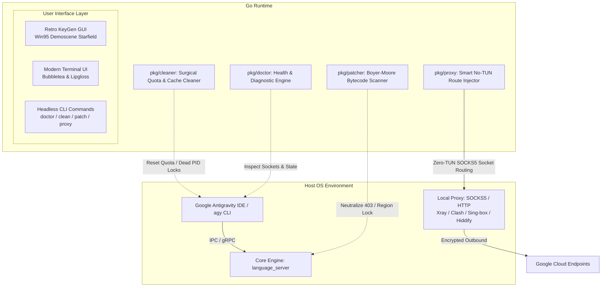

# 🏛️ Technical Architecture (v5.2.0)

## Overview
**Antigravity Cleaner** is an enterprise-grade, high-performance systems utility engineered in **pure Go (1.22+)**. It is compiled into a single, zero-dependency native binary for Linux, macOS, and Windows. It provides automated self-healing, regional sanction bypass, quota reset, and smart proxy injection for **Google Antigravity IDE**, the `agy` CLI, and the Google Antigravity VS Code extension.

---

## 🏗️ System Components

---

### 1. Diagnostic Engine (`pkg/doctor`)
* **Process Table Inspection:** Scans active processes for `antigravity`, `language_server`, and zombie child processes.
* **Port Conflict & Socket Monitoring:** Verifies binding availability for Antigravity IPC and internal gRPC channels.
* **Network & Gateway Probing:** Measures latency and SSL handshake completion against Google Cloud API endpoints (`cloudcode.googleapis.com`).
* **Environment Validation:** Verifies environment variable state (`HTTP_PROXY`, `HTTPS_PROXY`, `ALL_PROXY`, `NO_PROXY`).

### 2. Surgical Quota & Cache Cleaner (`pkg/cleaner`)
* **Atomic Reset:** Clears corrupted session locks, stale telemetry buffers, and transient rate-limit counters (HTTP 429) without affecting user workspaces or project configurations.
* **File Lock Reaping:** Safely releases stale PID handles and dangling socket descriptors.
* **Backup Preservation:** Automatically retains a rollback snapshot before performing file modifications.

### 3. High-Speed Bytecode Patcher (`pkg/patcher`)
* **Boyer-Moore Scan:** Scans `language_server` binary payloads at up to 1.9 GB/s throughput to locate regional eligibility and geo-fencing routines.
* **In-Place Neutralization:** Modifies branch conditions responsible for `User location is not supported` (HTTP 403 Forbidden) errors.
* **SHA-256 Checksum Validation:** Computes before-and-after cryptographic hashes ensuring absolute binary integrity.

### 4. Smart Proxy & No-TUN Injector (`pkg/proxy`)
* **Direct Socket Routing:** Routes outbound Antigravity IDE gRPC/HTTPS streams directly into local SOCKS5/HTTP proxy listeners (ports `10808`, `7890`, `1080`, etc.).
* **Zero TUN Overhead:** Eliminates the CPU, driver, and system routing table overhead of full-system VPN/TUN mode.
* **Active TCP KeepAlive:** Prevents intermediate stateful firewall timeouts on long-running LLM streaming responses.

### 5. Multi-Mode Presentation Layer
* **1-Click Retro KeyGen GUI:** Standalone executable requiring zero terminal interaction. Features Windows 95 aesthetics, procedural demoscene starfield, and retro sound effects.
* **Interactive Terminal UI (TUI):** Built with `charmbracelet/bubbletea` and `charmbracelet/lipgloss` for keyboard navigation, real-time gauges, and live diagnostic output.
* **Headless Scriptable CLI:** Deterministic exit codes and UNIX-pipeable JSON output for automated CI/CD and script integration.

---

## 🔒 Security & Privacy Guarantees
1. **100% Offline Execution:** Runs strictly on localhost (`127.0.0.1`). Contains no remote telemetry, analytics, or background call-homes.
2. **Deterministic & Reversible:** Every patching or cleaning operation can be inspected or reversed.
3. **Open Source:** Licensed under the international standard **Apache License 2.0**.
